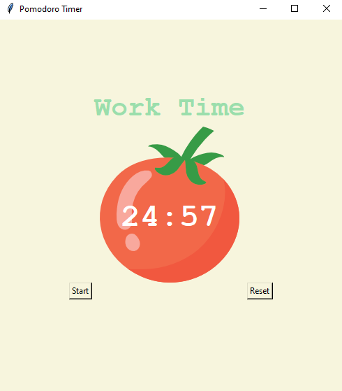

---

# Pomodoro Timer

## Overview

The Pomodoro Timer is a desktop application built using Python's `tkinter` library. It implements the Pomodoro Technique, a time management method that uses intervals of work and short breaks to improve productivity. This application features a simple UI to start, reset, and manage work sessions and breaks. 

## Features

- **Work Sessions:** 25 minutes of focused work time.
- **Short Breaks:** 5 minutes break after every work session.
- **Long Breaks:** 20 minutes break after every 4 work sessions.
- **Visual Timer:** Displays the remaining time in minutes and seconds.
- **Session Tracking:** Shows completed work sessions with checkmarks.
- **Customizable:** Easily adjustable work and break times.

## Installation

1. **Clone the Repository**

   ```bash
   git clone https://github.com/yourusername/pomodoro-timer.git
   ```

2. **Navigate to the Project Directory**

   ```bash
   cd pomodoro-timer
   ```

3. **Install Required Libraries**

   The project requires `tkinter` and `math` which are included with Python. No additional libraries are needed.

4. **Prepare Image Files**

   Ensure you have the `tomato.png` image file in the `project` directory. This image is used as part of the UI.

## Usage

1. **Run the Application**

   Execute the following command to start the Pomodoro Timer:

   ```bash
   python pomodoro_timer.py
   ```

2. **Interact with the UI**

   - **Start Button:** Begin the Pomodoro Timer. The timer will alternate between work sessions and breaks.
   - **Reset Button:** Stop the timer and reset the UI to its initial state.

## Code Structure

- **`pomodoro_timer.py`**: Main Python script containing the application logic and UI setup.
  - **Constants:** Colors and durations for the timer.
  - **Timer Reset (`reset`):** Function to reset the timer and UI.
  - **Timer Mechanism (`start_timer`):** Function to start the timer and manage work/break intervals.
  - **Countdown Mechanism (`count_down`):** Function to handle the countdown and update the UI.
  - **UI Setup:** Creates and configures the main window, canvas, labels, and buttons.

## Example

Here is a brief example of how the application looks and operates:

- **UI Elements:**
  - **Canvas:** Displays a tomato image and the timer.
  - **Labels:** Show the current session (e.g., "Work Time", "Short Break") and completed sessions (checkmarks).
  - **Buttons:** Controls to start and reset the timer.

## Screenshot

Here's a preview of the Pomodoro App:



## Contributing

Feel free to submit issues or pull requests. Contributions are welcome!

## Acknowledgements

- **Pomodoro Technique:** Developed by Francesco Cirillo.
- **tkinter:** Python’s standard GUI library for building the UI.


## License

This project is licensed under the MIT License. See the [LICENSE](LICENSE) file for details.

---
